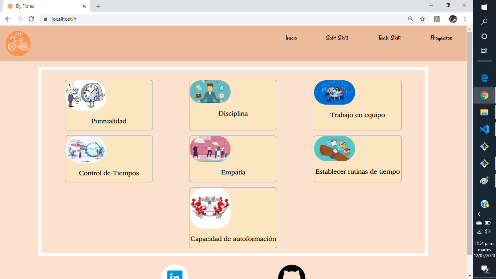
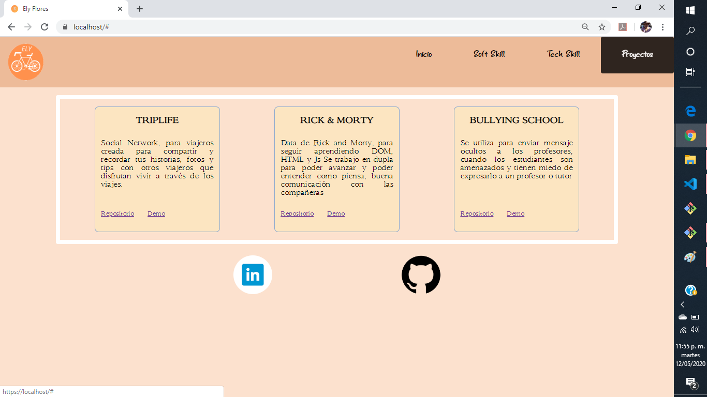

# PortafolioEly
Portafolio de proyectos desarrollados.

## Inicio

Muestra la pantalla de inicion, del portafolio 

## Soft Skills

Al dar click del menú en "Soft skill", se muestrara una pantalla donde en listar las habilidades blandas.

## Tech Skill

Si se da clikk en "Teck skill", se en lista los nombre de las herramientas con las que se ha trabajado en diferentes proyectos.

# Proyectos

Al dar clik en "Proyect", muestra el nombre y descripcion de los proyecto que se han generando.

